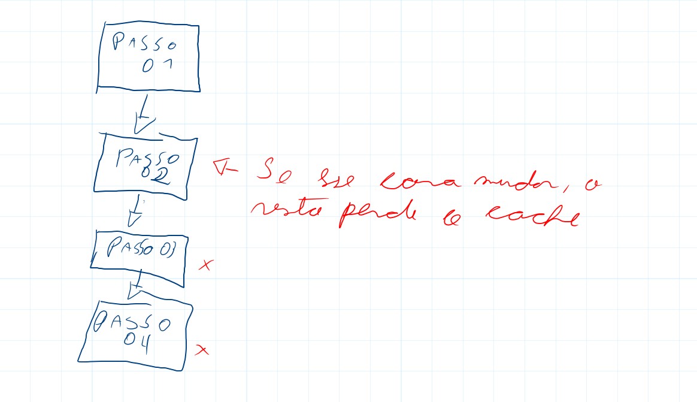

# Layer Cache
Sempre que buildamos nossas imagens é gerado uma imagem "temp" a cada comando(cada linha do arquivo Dockerfile), e isso fica em cache, você pode ver que na primeira vez demora mais, e nas próximas vais mais rápido o build.
Só que temos um problema, sempre que mudar o comando ou parâmetros no docker file, o que tem daquela linha para baixo "perde" o cache e precisamos processar novamente, deixando o processo mais lento.

No exemplo da imagem mudamos algo no **Passo 02** e o passo 03 e 04 perderam o cache.

Imagina que o **Processo 02** só cria uma pasta de cache, e o **03 e 04** fazem dowloads demorados, o correto e deixar o **02** e os demais comandos que podemm um variar por último, pois caso perca o cache não teras problema de lentidão.

Se você usa **CI-CD** em um ambiente local, isso pode salvar sua vida e diminuir gastos e tempo, pois sempre que rodar o build teras boa parte em cache.

OBS: se você usa um plano padrão com uma maquina do Github para rodar as Actions não tem muito o que fazer inicialmente(até tem, mas da trabalho)