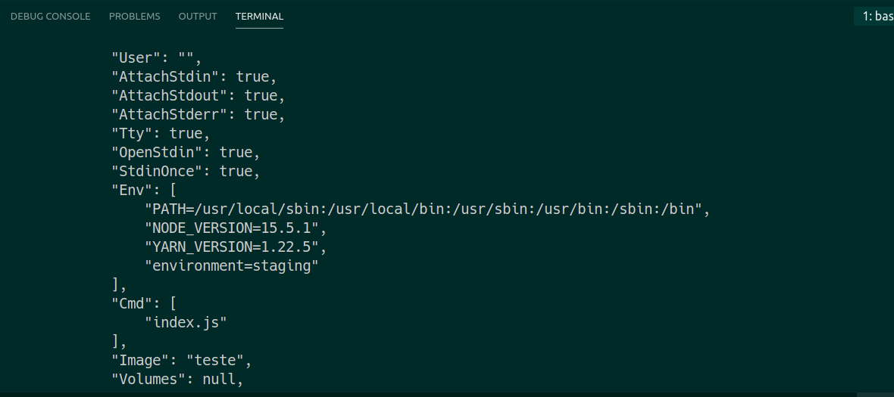

# Variaveis de ambiente

Isso ajuda muito em relação a builds e coisas do tipo, mas, podemos ter problema de segurança, pois quando colocamos uma senha no env, ela fica exposta quando damos um docker inspect

