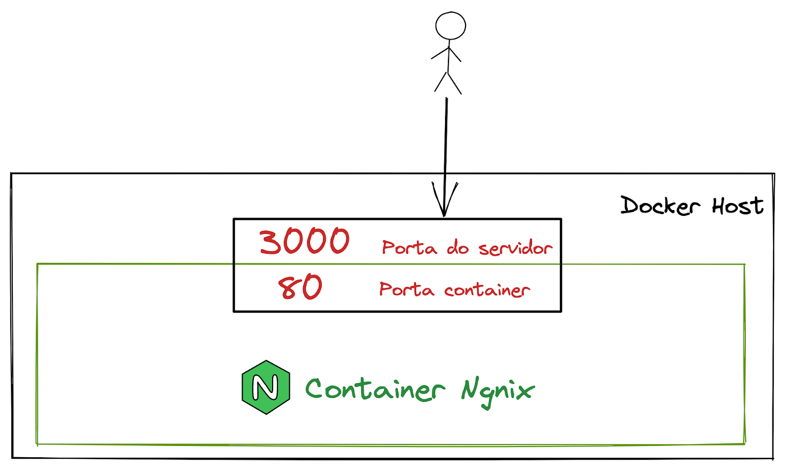

# Portas em um container

Para fazer o bind da porta do container com a do seu computador(acessar com localhost), pasta usar o seguinte parametro:

````
docker run ... -p porta-local:porta-container ...
````

Se voce não quiser fazer o bind da porta, basta voce rodar `docker info`, pegar o ip do container e acessar colocando a porta. Isso só vai funcionar bem em ambientes Linux, onde temos a ligação da rede Docker0 com a rede local


