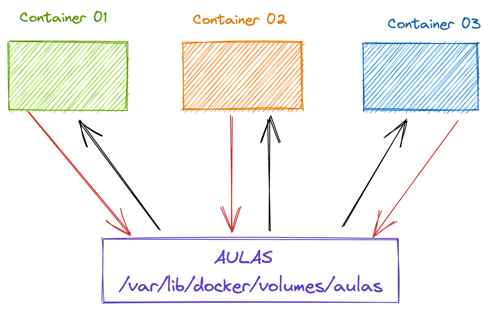

# Volumes nomeados

Muito bom apra ambientes de producao, já que em desenvolvimento o mais fácil é apontar direto apra a pasta do projeto.
Alem de ser guardado em um lugar especifico, temos a oportunidade de guardar um volue nomeado na memoria, no Azure, em rede... em vários storages. Poder guardar o volume não somente no servidor ajuda na escala.

- Para listar os vlumes basta rodar o comando `docker volumes ps`

- Para remover um volume basta rodar o comando `docker volumes rm nome-do-volume`

- Para remover todos os volumes que não estão sendo usado `docker volumes prune`

- Para saber informacões sobre o vlume `docker volume inspect nome-do-volume`

[Documentacão com plugins de volumes](https://docs.docker.com/engine/extend/legacy_plugins/#volume-plugins)

