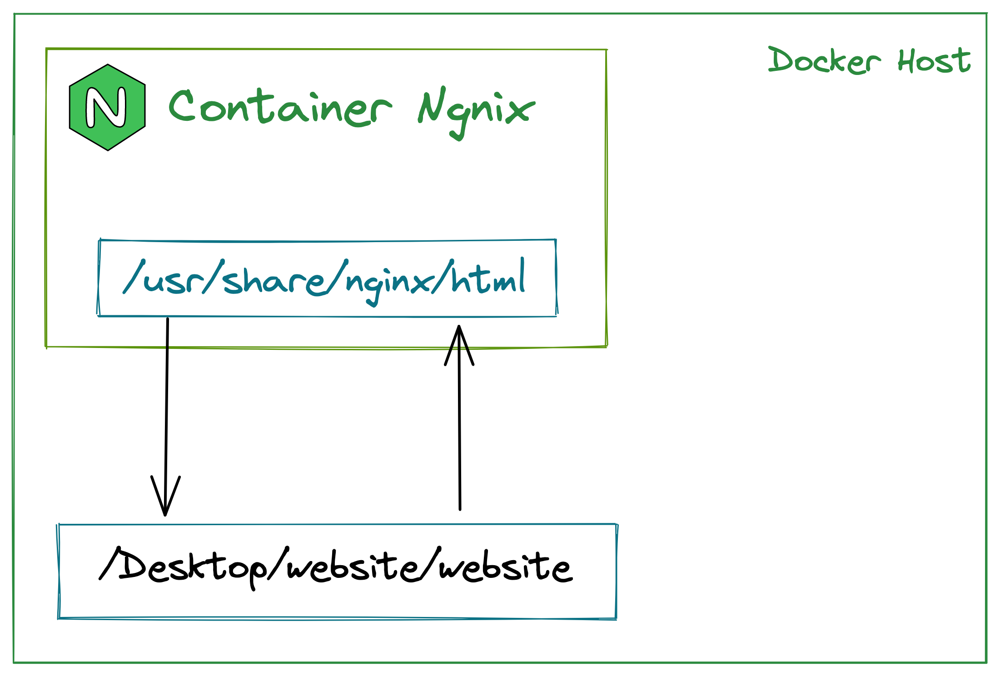

# Volumes no dokcer

Para criar volumes entre pastas:

```
docker run -v diretorio-local:diretorio-servidor
```

Se voce não quiser passar o caminho completo da pasta local, tu podes usar o seguinte "comando" para indicar a pasta atual.

```
"$(pwd)"/sub-pasta-local:/pasta-no-container/
```


